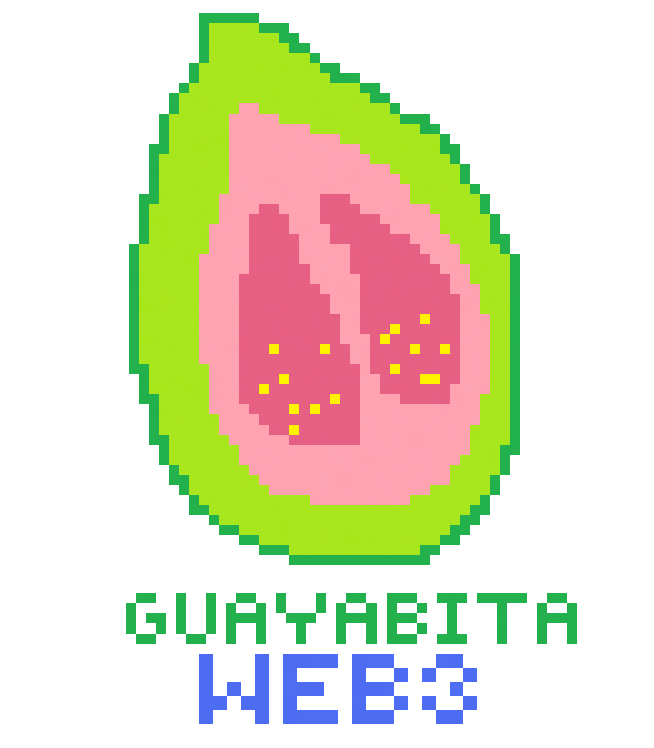
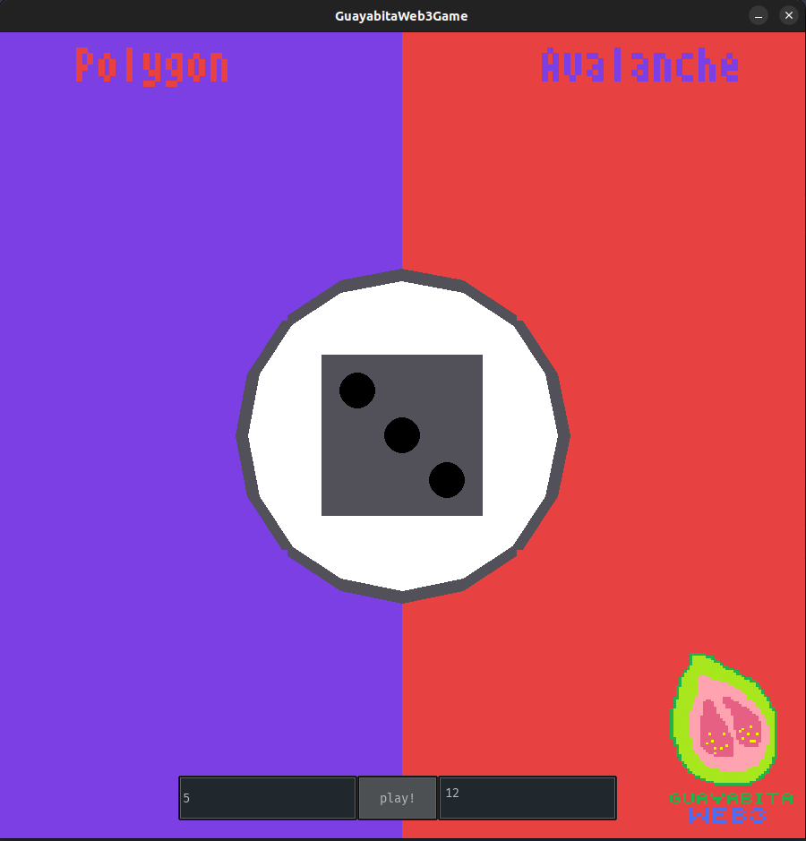

# guayabita_game

A Colombian dice game, bringing fun to save the planet, play Guayabita!

# Demo video

## VRF contract

VRFv2Consumer test contract: https://sepolia.etherscan.io/address/0x92cd21e4d37cef282af6d36fd8c69c0926d9d163

## Token GU contract

Token GuayabitaTk (GU) contract: https://mumbai.polygonscan.com/address/0xeb7700933284780A6727C1e3fd273E131bBA1dC0

## Contract CCIP Polygon - Avalanche

https://ccip.chain.link/msg/0xbbdbeb01a83a0df598483c890337e9bf17cadb8f51e189c50b61447b32f5deb5

## Polygon contract

https://mumbai.polygonscan.com/address/0x8523c1d25da7df6e5f7770eb002bcc9a0deccf7c

## Avalanche contract

https://testnet.snowtrace.io/address/0x97a9ffc045b4a89d0148bded7181f7ec048d05b8

## UI

## Environment variables

* PYTHONUNBUFFERED=1
* ORIGIN_FONT=Atari_Small.ttf
* CONTRACT_VRF=0x92Cd21e4d37cef282Af6d36fD8c69c0926d9d163
* PRIV_KEY=XXXXXXXXXXXXXXXXX
* WALLET=XXXXXXXXXXXXXXXXXX